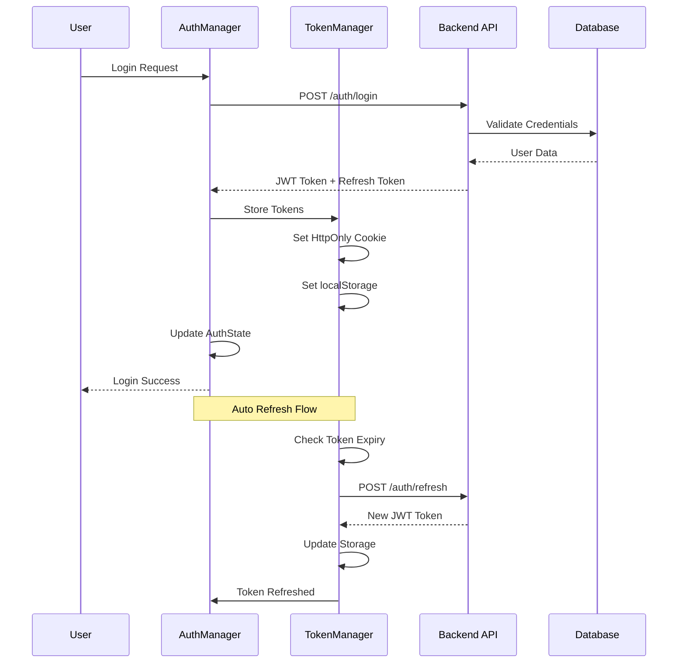

# Architecture d'Authentification avec AuthManager

## 📋 Vue d'ensemble

L'architecture d'authentification de WakeDock est centrée autour d'un `AuthManager` qui gère de manière sécurisée l'authentification JWT, les sessions utilisateur et les permissions.

## 🏗️ Architecture Globale

```
┌─────────────────────────────────────────────────────────────────┐
│                    Frontend (Next.js)                          │
├─────────────────────────────────────────────────────────────────┤
│  ┌─────────────────┐    ┌─────────────────┐    ┌─────────────────┐│
│  │   AuthManager   │    │   TokenManager  │    │  SessionManager ││
│  │   (Singleton)   │◄──►│   (JWT Logic)   │◄──►│  (Session UI)   ││
│  └─────────────────┘    └─────────────────┘    └─────────────────┘│
│           │                       │                       │      │
│  ┌─────────────────┐    ┌─────────────────┐    ┌─────────────────┐│
│  │   AuthStore     │    │   CSRFManager   │    │   RateLimiter   ││
│  │   (Reactive)    │    │   (Security)    │    │   (Protection)  ││
│  └─────────────────┘    └─────────────────┘    └─────────────────┘│
└─────────────────────────────────────────────────────────────────┘
                                  │
                              HTTP/HTTPS
                                  │
┌─────────────────────────────────────────────────────────────────┐
│                    Backend (FastAPI)                           │
├─────────────────────────────────────────────────────────────────┤
│  ┌─────────────────┐    ┌─────────────────┐    ┌─────────────────┐│
│  │   AuthService   │    │   JWTManager    │    │   UserService   ││
│  │   (Business)    │◄──►│   (Tokens)      │◄──►│   (Users)       ││
│  └─────────────────┘    └─────────────────┘    └─────────────────┘│
│           │                       │                       │      │
│  ┌─────────────────┐    ┌─────────────────┐    ┌─────────────────┐│
│  │   AuthMiddleware│    │   SecurityAudit │    │   PermissionMgr ││
│  │   (Middleware)  │    │   (Logging)     │    │   (RBAC)        ││
│  └─────────────────┘    └─────────────────┘    └─────────────────┘│
└─────────────────────────────────────────────────────────────────┘
```

## 🔐 Components Principaux

### 1. AuthManager (Frontend)
**Responsabilités:**
- Gestion centralisée de l'authentification
- Orchestration des autres composants
- Gestion des événements d'authentification
- Interface unique pour l'application

**Fonctionnalités:**
- Singleton pattern pour instance unique
- Event-driven architecture
- State management centralisé
- Plugin system extensible

### 2. TokenManager (Frontend)
**Responsabilités:**
- Gestion des tokens JWT
- Refresh automatique
- Stockage sécurisé
- Validation côté client

**Fonctionnalités:**
- Stockage HttpOnly cookies + localStorage
- Rotation automatique des tokens
- Validation de l'expiration
- Gestion des erreurs de token

### 3. SessionManager (Frontend)
**Responsabilités:**
- Gestion des sessions utilisateur
- Interface utilisateur pour l'auth
- Gestion multi-onglets
- Timeout de session

**Fonctionnalités:**
- Session timeout configurable
- Support multi-onglets
- Notifications de session
- Dégradation gracieuse

### 4. AuthStore (Frontend)
**Responsabilités:**
- État réactif d'authentification
- Persistance des données
- Hydration au démarrage
- Nettoyage sécurisé

**Fonctionnalités:**
- État réactif avec observateurs
- Persistance sécurisée
- Restoration d'état
- Cleanup automatique

## 🔒 Sécurité

### Protection CSRF
- Tokens anti-CSRF pour actions sensibles
- Validation côté serveur
- Headers sécurisés

### Protection XSS
- Sanitisation des données
- Content Security Policy
- Validation des entrées

### Rate Limiting
- Limitation des tentatives de connexion
- Protection contre brute force
- Timeouts progressifs

### Audit et Logging
- Traçabilité des connexions
- Détection d'anomalies
- Logs sécurisés

## 🚀 Implémentation

### Phase 1: Structure de Base
1. Créer AuthManager singleton
2. Implémenter TokenManager
3. Configurer AuthStore
4. Mettre en place SessionManager

### Phase 2: Sécurité
1. Implémenter CSRFManager
2. Configurer RateLimiter
3. Mettre en place AuditLogger
4. Tests de sécurité

### Phase 3: Intégration
1. Intégration avec le backend
2. Gestion des erreurs
3. Optimisation des performances
4. Tests E2E

## 🧪 Tests

### Tests de Sécurité
- Tests de vulnérabilités
- Tests de penetration
- Audit de sécurité
- Validation des tokens

### Tests de Performance
- Temps de connexion
- Refresh de tokens
- Gestion de charge
- Optimisation mémoire

### Tests d'Intégration
- Frontend/Backend
- Multi-navigateurs
- Multi-onglets
- Scenarios réels

## 📊 Métriques

### KPIs Sécurité
- Security Score ≥95%
- Token Refresh <200ms
- 0 faille de sécurité
- Audit compliance 100%

### KPIs Performance
- Temps de connexion <500ms
- Refresh token <200ms
- Session timeout précis
- 0 perte de session

## 🔄 Flux d'Authentification



## 🛡️ Gestion des Erreurs

### Erreurs d'Authentification
- Invalid credentials
- Token expired
- Token invalid
- Session timeout

### Erreurs de Sécurité
- CSRF attack detected
- Rate limit exceeded
- Suspicious activity
- Unauthorized access

### Gestion des Erreurs
- Logs détaillés
- Notifications utilisateur
- Fallback sécurisé
- Recovery automatique

## 📝 Configuration

### Variables d'Environnement
```typescript
interface AuthConfig {
  jwtSecret: string;
  tokenExpiry: number;
  refreshExpiry: number;
  sessionTimeout: number;
  maxLoginAttempts: number;
  rateLimitWindow: number;
  csrfEnabled: boolean;
  auditEnabled: boolean;
}
```

### Configuration Sécurité
```typescript
interface SecurityConfig {
  httpOnly: boolean;
  secure: boolean;
  sameSite: 'strict' | 'lax' | 'none';
  domain: string;
  path: string;
  maxAge: number;
}
```

---

*Cette architecture garantit une authentification sécurisée et maintien-able pour WakeDock.*